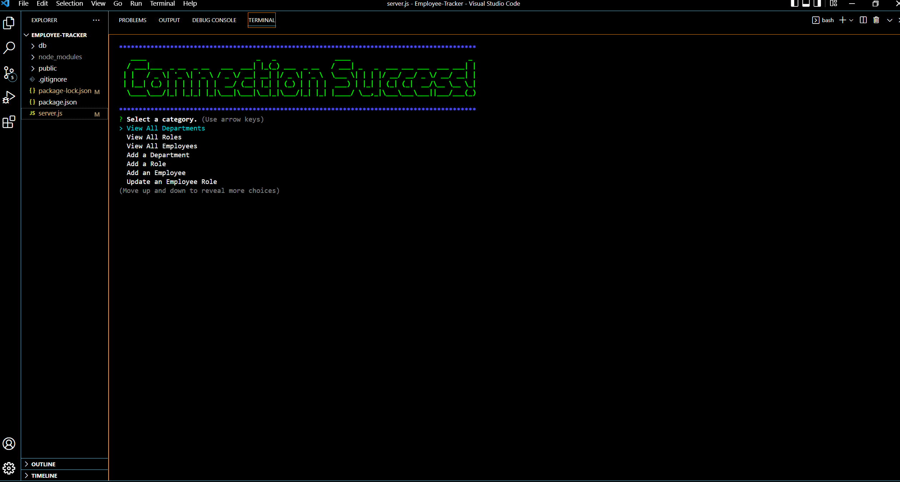

# Employee-Tracker

  

  ## Table of Contents
  * [Description](#description)
  * [Installation](#installation)
  * [Usage](#usage)
  * [Contributors](#contributors)
  * [Tests](#tests)
  * [License](#license)
  * [Questions](#questions)
  
  ## Description 
  This program's purpose is to show how to utilize a database through MySQL with the help of javaScript. In this program we are showcasing the different kinds of data inside a database for a business. You can view different records, you can add a new department, you can add an employee to your existing employee data, you can update and change an employee's role, and you can add a new role. This program will also show you how to create a database, tables, rows and input the values for these areas. The modules used in this program through node.js is inquirer, chalk, figlet, mysql2, and console.table.
  
  ## Installation 
  Must have a code editor. Need to have a basic foundation of JavaScript, node.js, MySQL, mysql2 module, and inquirer module.

  ## Usage 
  The beneficial usage of this program is being able to show competency and a skill set in managing a database.

  ## Contributors
  Open for contribution.

  ## Tests
  Follow the walk-through video for testing purposes.

  ## License 
  The application is covered under the ISC license.

  ## Image
  

  ## Live Demo
https://user-images.githubusercontent.com/84283930/169943952-237ab554-9a2e-47ef-ae87-e086faeef745.mp4

  ## Questions
  You can search for my repo on GitHub by entering Bungycode and you can view my projects at https://github.com/Bungycode. If you have any questions, please contact me at thedevandrew@gmail.com

